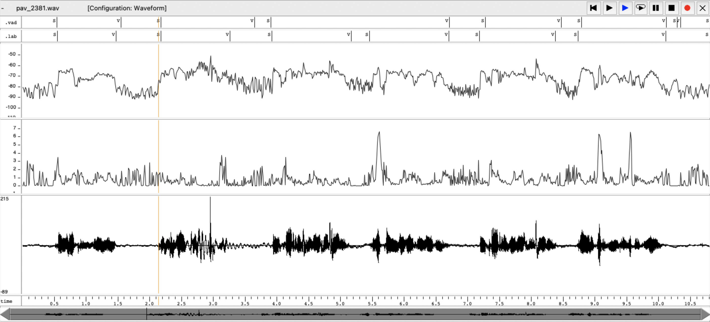
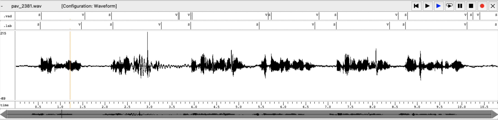
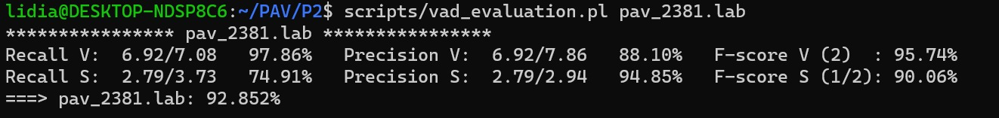
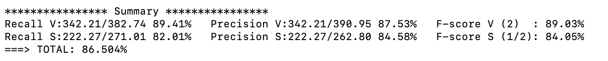
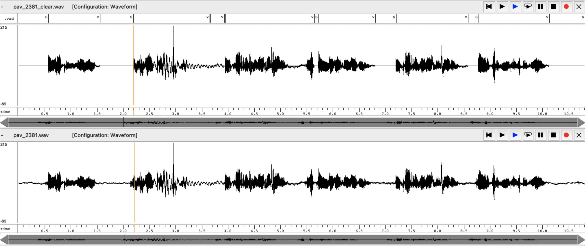
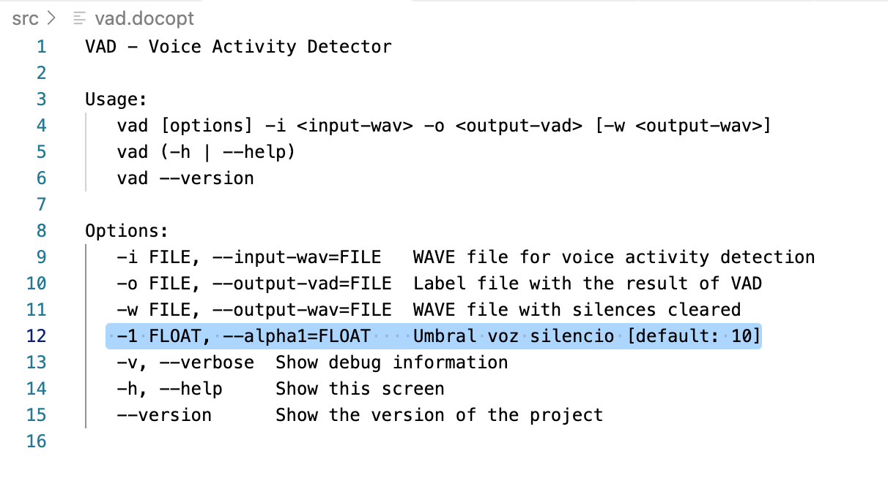

PAV - P2: detección de actividad vocal (VAD)
============================================

Esta práctica se distribuye a través del repositorio GitHub [Práctica 2](https://github.com/albino-pav/P2),
y una parte de su gestión se realizará mediante esta web de trabajo colaborativo.  Al contrario que Git,
GitHub se gestiona completamente desde un entorno gráfico bastante intuitivo. Además, está razonablemente
documentado, tanto internamente, mediante sus [Guías de GitHub](https://guides.github.com/), como
externamente, mediante infinidad de tutoriales, guías y vídeos disponibles gratuitamente en internet.


Inicialización del repositorio de la práctica.
----------------------------------------------

Para cargar los ficheros en su ordenador personal debe seguir los pasos siguientes:

*	Abra una cuenta GitHub para gestionar esta y el resto de prácticas del curso.
*	Cree un repositorio GitHub con el contenido inicial de la práctica (sólo debe hacerlo uno de los
	integrantes del grupo de laboratorio, cuya página GitHub actuará de repositorio central del grupo):
	-	Acceda la página de la [Práctica 2](https://github.com/albino-pav/P2).
	-	En la parte superior derecha encontrará el botón **`Fork`**. Apriételo y, después de unos segundos,
		se creará en su cuenta GitHub un proyecto con el mismo nombre (**P2**). Si ya tuviera uno con ese 
		nombre, se utilizará el nombre **P2-1**, y así sucesivamente.
*	Habilite al resto de miembros del grupo como *colaboradores* del proyecto; de este modo, podrán
	subir sus modificaciones al repositorio central:
	-	En la página principal del repositorio, en la pestaña **:gear:`Settings`**, escoja la opción 
		**Collaborators** y añada a su compañero de prácticas.
	-	Éste recibirá un email solicitándole confirmación. Una vez confirmado, tanto él como el
		propietario podrán gestionar el repositorio, por ejemplo: crear ramas en él o subir las
		modificaciones de su directorio local de trabajo al repositorio GitHub.
*	En la página principal del repositorio, localice el botón **Branch: master** y úselo para crear
	una rama nueva con los primeros apellidos de los integrantes del equipo de prácticas separados por
	guion (**fulano-mengano**).
*	Todos los miembros del grupo deben realizar su copia local en su ordenador personal.
	-	Copie la dirección de su copia del repositorio apretando en el botón **Clone or download**.
		Asegúrese de usar *Clone with HTTPS*.
	-	Abra una sesión de Bash en su ordenador personal y vaya al directorio **PAV**. Desde ahí, ejecute:

		```.sh
		git clone dirección-del-fork-de-la-práctica
		```

	-	Vaya al directorio de la práctica `cd P2`.
	-	Añada la etiqueta `origin` a su copia del repositorio. Esto es útil para facilitar los *push* y
		*pull* al repositorio original:
		```.sh
		git remote add origin dirección-del-fork-de-la-práctica
		```
	-	Cambie a la rama **fulano-mengano** con la orden:

		```.sh
		git checkout fulano-mengano
		```

*	A partir de este momento, todos los miembros del grupo de prácticas pueden trabajar en su directorio
	local del modo habitual.
	-	También puede utilizar el repositorio remoto como repositorio central para el trabajo colaborativo
		de los distintos miembros del grupo de prácticas; o puede serle útil usarlo como copia de
		seguridad.
	-	Cada vez que quiera subir sus cambios locales al repositorio GitHub deberá confirmar los
		cambios en su directorio local:

		```.sh
		git add .
		git commit -m "Mensaje del commit"
		```

		y, a continuación, subirlos con la orden:

		```.sh
		git push -u origin fulano-mengano
		```

*	Al final de la práctica, la rama **fulano-mengano** del repositorio GitHub servirá para remitir la
	práctica para su evaluación utilizando el mecanismo *pull request*.
	-	Vaya a la página principal de la copia del repositorio y asegúrese de estar en la rama
		**fulano-mengano**.
	-	Pulse en el botón **New pull request**, y siga las instrucciones de GitHub.


Entrega de la práctica.
-----------------------

Responda, en este mismo documento (README.md), los ejercicios indicados a continuación. Este documento es
un fichero de texto escrito con un formato denominado _**markdown**_. La principal característica de este
formato es que, manteniendo la legibilidad cuando se visualiza con herramientas en modo texto (`more`,
`less`, editores varios, ...), permite amplias posibilidades de visualización con formato en una amplia
gama de aplicaciones; muy notablemente, **GitHub**, **Doxygen** y **Facebook** (ciertamente, :eyes:).

En GitHub. cuando existe un fichero denominado README.md en el directorio raíz de un repositorio, se
interpreta y muestra al entrar en el repositorio.

Debe redactar las respuestas a los ejercicios usando Markdown. Puede encontrar información acerca de su
sintáxis en la página web [Sintaxis de Markdown](https://daringfireball.net/projects/markdown/syntax).
También puede consultar el documento adjunto [MARKDOWN.md](MARKDOWN.md), en el que se enumeran los
elementos más relevantes para completar la redacción de esta práctica.

Recuerde realizar el *pull request* una vez completada la práctica.

Ejercicios
----------

### Etiquetado manual de los segmentos de voz y silencio

- Etiquete manualmente los segmentos de voz y silencio del fichero grabado al efecto. Inserte, a 
  continuación, una captura de `wavesurfer` en la que se vea con claridad la señal temporal, el contorno de
  potencia y la tasa de cruces por cero, junto con el etiquetado manual de los segmentos.

  -> Etiquetamos manualmente los segmentos de voz y audio con el fichero LAB.P1.1.lab. A continuación, comparamos 
  las transacciones con el `wavesurfer`. Seguido se puede observar la captura obenida. Además, adjuntamos las gráficas 
  de 'crucesporzero.txt' (Panel intermedio) y de 'potenciaREAL.pot' (Panel superior). 
  Representamos a la parte superior de la captura las transcripciones .lab (teorica nuestra) y la .vad (propia de la señal) para ver los 
  ajustes de clasificación de voz (V) y silencio (S). 
  
<p align="center">
  
</p>

- A la vista de la gráfica, indique qué valores considera adecuados para las magnitudes siguientes:

	* Incremento del nivel potencia en dB, respecto al nivel correspondiente al silencio inicial, para
	  estar seguros de que un segmento de señal se corresponde con voz.
	 
	-> Tenemos que tener en cuenta que nuestro audio no es de muy buena calidad, es decir, la potencia del ruido es muy grande comparada
	con la potencia del volumen. Por ello, el threshold escogido es bastante bajo y asi podemos detectar mejor la voz. 
	-> Viendo la señal obtenida y su potencia, el valor depende de la amplitud del ruido en dB. 
	Con esto, en nuestra señal consideramos un margen de k0= 4dB y k1 = 1dB, siendo k0 el primer umbral que decide voz y silencio, 
	y k1 el segundo umbral que asegura el estado de voz.
	
	* Duración mínima razonable de los segmentos de voz y silencio.

	 ->En nuestra gráfica hemos podido observar que el tiempo mínimo para detectar un silencio es de 81 ms y el 
	 de la voz es de 190 ms. Estos tiempos son los más pequeños que encontramos en nuestra señal y usamos 
	 como referéncia. 

	* ¿Es capaz de sacar alguna conclusión a partir de la evolución de la tasa de cruces por cero?

	->Podemos observar que en las consonantes sordas fricativas de resonancias altas como la /s/ y el fonema /ch/ 
	dan picos en la gráfica de cruces por zero. En cambio, en los silencios, dado que tienen mucho 
	ruido, se representan con una gran cantidad de picos.

	

### Desarrollo del detector de actividad vocal

- Complete el código de los ficheros de la práctica para implementar un detector de actividad vocal tan
  exacto como sea posible. Tome como objetivo la maximización de la puntuación-F `TOTAL`.

- Inserte una gráfica en la que se vea con claridad la señal temporal, el etiquetado manual y la detección
  automática conseguida para el fichero grabado al efecto. 

<p align="center">
  
</p>

- Explique, si existen, las discrepancias entre el etiquetado manual y la detección automática.

-> Podemos ver algunas pequeñas discrepancias debido a que tenemos una señal con mucho ruido y hay tramas
en las que cuesta detectar el silencio o incluso lo detecta tarde. 

- Evalúe los resultados sobre la base de datos `db.v4` con el script `vad_evaluation.pl` e inserte a 
  continuación las tasas de sensibilidad (*recall*) y precisión para el conjunto de la base de datos (sólo
  el resumen).

<p align="center">
  
</p>

<p align="center">
  
</p>

-> Respecto el resultado de nuestra señal, obtenemos un total de 92,852%. En cambio, en el general un 86,504%. 
Eso es así, ya que nuestra señal es de una calidad muy baja. Para conseguir unos buenos resultados en nuestra señal hemos tenido 
que ajustar mucho los umbrales, de forma conservadora, sin embargo este ajuste no ha beneficiado tanto en el analisis de las bases de datos.
Respecto al general, vemos que la mayoria de los ficheros obtienen porcentajes de entre 80% y 90%, no obstante podemos encontrar algunas señales que
obtienen un 70%. Esto hace que la media obtenida sea un poco baja. 


### Trabajos de ampliación

#### Cancelación del ruido en los segmentos de silencio

- Si ha desarrollado el algoritmo para la cancelación de los segmentos de silencio, inserte una gráfica en
  la que se vea con claridad la señal antes y después de la cancelación (puede que `wavesurfer` no sea la
  mejor opción para esto, ya que no es capaz de visualizar varias señales al mismo tiempo).
  
<p align="center">

</p>

-> Tal y como podemos ver en la gráfica adjunta (la gráfica inferior es nuestra señal y la superior la resultante), 
las tramas de silencio detectadas se han puesto a zero. 


#### Gestión de las opciones del programa usando `docopt_c`

- Si ha usado `docopt_c` para realizar la gestión de las opciones y argumentos del programa `vad`, inserte
  una captura de pantalla en la que se vea el mensaje de ayuda del programa.
  
<p align="center">

</p>
  
-> Para poder añadir y facilitar, en ciertas variables, el uso y obtención de umbrales más precisos, hemos editado el fichero 'docopt_c'
añadiendo la variable 'alpha1'. 


### Contribuciones adicionales y/o comentarios acerca de la práctica

- Indique a continuación si ha realizado algún tipo de aportación suplementaria (algoritmos de detección o 
  parámetros alternativos, etc.).

- Si lo desea, puede realizar también algún comentario acerca de la realización de la práctica que
  considere de interés de cara a su evaluación.
  
  -> Contribuciones adicionales: 
  1. Hemos añadido un algoritmo que al inicio de la señal coge X tramas (que se asumen como silencio) y calcula su potencia aritmética. 
  Después, utiliza una variable que marca el porcentaje de potencia que debe superar la señal al inicio antes de considerarse voz (vad_data->pPot). 
  De esta manera, podemos calcular de forma adaptativa el umbral k0 teniendo en cuenta las máximas muestras posibles de silencio. 
  2. También, hemos añadido un número de muestras estables que deben superarse antes de cambiar de estado, tanto en el inicio de la señal como 
  en los estados de transición ST_MB_VOICE y ST_MB_SILENCE. Esto nos ayuda a evitar posibles cambios de estado por picos de 
  potencia que no sean realistas, como silencios demasiado cortos o ruidos desfavorables. 
  
  -> Conclusión final de nuestro proyecto: 
  1. A pesar de tener una señal ruidosa y con problemas de volumen, hemos obtenido un buen resultado. Además, hemos añadido ciertas funcionalidades
  que son interesantes y nos han permitido una mejor detección. 
  2. Para futuros proyectos nos gustaria añadir un filtro de ruido pasa-banda centrado en 1kHz, que nos ayudaria a reducir los problemas de ruido
  que hemos tenido en esta ocasión. También nos gustaria mejorar las transiciones entre estados para que el resultado sea más preciso.


### Antes de entregar la práctica

Recuerde comprobar que el repositorio cuenta con los códigos correctos y en condiciones de ser 
correctamente compilados con la orden `meson bin; ninja -C bin`. El programa generado (`bin/vad`) será
el usado, sin más opciones, para realizar la evaluación *ciega* del sistema.
